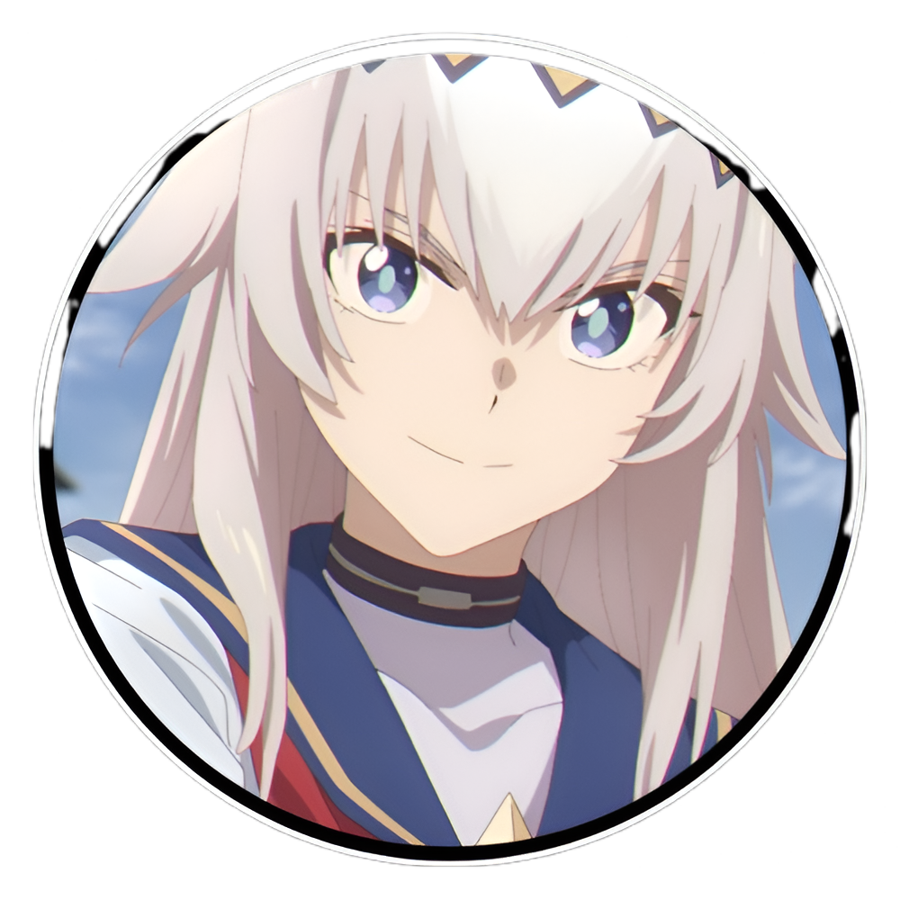

  

 

  
  <h1>Welcome to Hectorsxo's profile! 👋</h1>

  
<h4>✦ <b>Hectorsxo</b> is my handle name, you may know me as <b>Héctor</b>.</h4>

<h4>✦ Currently studying full-time <b>GS DAM</b> in Spain.</h4>

<h4>✦ Languages: <b>Spanish</b> (Native) & <b>English</b>.</h4>

<h4>✦ Passionate about <b>programming</b> and <b>anime</b>.</h4>

<h4>✦ Nice to meet you!</h4>

 

<h2 align="center">🗿 What I Work With (Mostly)</h2>

<h4>✦ Version Control ↴</h4>

<h4>✦ Programming Languages ↴</h4>

<h4>✦ Backend Development ↴</h4>

<h4>✦ Frontend Development ↴</h4>

<h4>✦ Design & Tools ↴</h4>

<h4>✦ Social ↴</h4>

 

  
  
<i>Thanks for visiting, bye! 👋</i>

